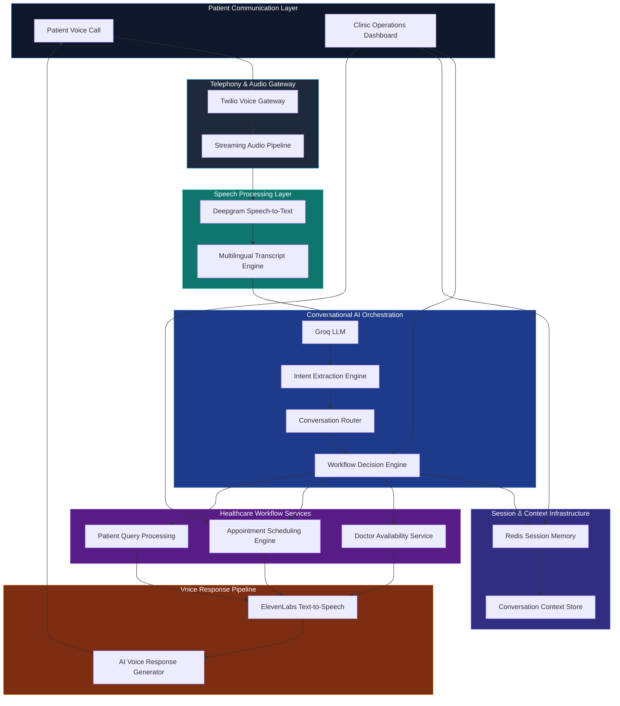

# Clinivo AI

## Intelligent Voice Infrastructure for Healthcare Communication

Clinivo AI is a multilingual AI-powered healthcare communication platform designed to automate patient interaction workflows, appointment inquiries, scheduling operations, and clinic communication systems using low-latency conversational AI infrastructure.

The platform combines telephony, speech recognition, conversational AI orchestration, distributed session management, and voice synthesis into a unified healthcare voice workflow system.

---
## Live Frontend Demo

https://clinivo-ai.vercel.app/

# Platform Overview

Clinivo AI is designed around asynchronous voice communication pipelines capable of:

* Handling inbound patient calls
* Processing multilingual speech input
* Understanding conversational intent
* Managing appointment workflows
* Maintaining conversational memory
* Generating natural AI voice responses
* Supporting healthcare operational workflows

The system architecture is modular, service-oriented, and designed for scalable voice workflow orchestration.

---

# AI Voice Workflow Architecture




---

# System Architecture

## Telephony Layer

Responsible for handling inbound and outbound clinic communication workflows.

### Technologies

* Twilio Voice
* Webhook-based communication routing
* Real-time voice event handling

---

## Speech Processing Layer

Converts multilingual patient audio into structured conversational text.

### Technologies

* Deepgram Speech-to-Text
* Streaming transcription pipeline
* Multilingual voice processing

---

## Conversational AI Layer

Processes conversational intent, appointment requests, scheduling logic, and operational workflows.

### Technologies

* Groq LLM
* Prompt orchestration
* Intent extraction
* Conversational routing

---

## Session Memory Layer

Maintains conversational state and workflow continuity across patient interactions.

### Technologies

* Redis
* Distributed session persistence
* Context-aware conversation tracking

---

## Voice Response Layer

Generates multilingual AI voice responses for patient communication.

### Technologies

* ElevenLabs TTS
* Voice synthesis pipeline
* Real-time audio generation

---

# Backend Architecture

```text
backend/
│
├── app/
│   ├── core/
│   ├── middleware/
│   ├── routes/
│   ├── services/
│   ├── voice/
│   ├── ai/
│   ├── models/
│   └── utils/
│
├── tests/
├── requirements.txt
├── Dockerfile
├── docker-compose.yml
└── main.py
```

---

# Key Features

## Multilingual Voice Communication

Supports multilingual patient interactions including English, Tamil, and Tanglish conversational workflows.

---

## AI-Powered Appointment Handling

Automates doctor availability checks, appointment inquiries, and scheduling workflows.

---

## Distributed Conversational Memory

Maintains contextual conversation state using Redis-backed session infrastructure.

---

## Low-Latency AI Pipeline

Built around asynchronous FastAPI workflows for real-time conversational responsiveness.

---

## Modular Service Architecture

Designed using modular backend services for maintainability and scalable orchestration.

---

# Technology Stack

| Layer              | Technologies   |
| ------------------ | -------------- |
| Backend Framework  | FastAPI        |
| Telephony          | Twilio         |
| Speech Recognition | Deepgram       |
| Conversational AI  | Groq           |
| Session Memory     | Redis          |
| Voice Synthesis    | ElevenLabs     |
| Containerization   | Docker         |
| CI/CD              | GitHub Actions |

---

# Repository Architecture Linking

The frontend architecture diagram directly links to relevant backend implementation modules.

## Example Mappings

| Architecture Node | Backend Module                     |
| ----------------- | ---------------------------------- |
| Twilio Voice      | `/app/routes/voice_routes.py`      |
| Deepgram STT      | `/app/voice/`                      |
| Groq LLM          | `/app/services/ai_brain.py`        |
| Redis Sessions    | `/app/services/session_service.py` |
| ElevenLabs TTS    | `/app/voice/tts_service.py`        |

---

# Deployment Roadmap

## Current Status

* Backend architecture implemented
* Voice workflow orchestration implemented
* Frontend operational workflow simulation completed
* Architecture visualization integrated
* API integrations in progress

---

## Planned Improvements

* Real-time streaming voice pipeline
* Production deployment infrastructure
* Kubernetes orchestration
* Healthcare CRM integration
* Analytics dashboards
* Multi-clinic tenancy
* AI workflow optimization

---

# Local Development Setup

## Clone Repository

```bash
git clone https://github.com/yourusername/clinivo-ai.git
```

---

## Create Environment

```bash
python -m venv venv
```

---

## Install Dependencies

```bash
pip install -r requirements.txt
```

---

## Configure Environment Variables

Create a `.env` file:

```env
TWILIO_ACCOUNT_SID=
TWILIO_AUTH_TOKEN=
DEEPGRAM_API_KEY=
GROQ_API_KEY=
ELEVENLABS_API_KEY=
REDIS_URL=
```

---

## Run Application

```bash
uvicorn main:app --reload
```

---

# Frontend Workflow Visualization

The landing page includes:

* Animated AI workflow architecture
* Interactive infrastructure nodes
* GitHub-linked backend modules
* Operational workflow simulation dashboard
* Responsive healthcare SaaS interface

---

# Disclaimer

This project is currently an engineering prototype and workflow simulation platform focused on healthcare voice automation infrastructure.

It is not currently deployed in production clinical environments.

---

# Contact

## Mohamed Shalman Kursheeth K

Backend Engineering • AI Systems • Voice Infrastructure

📧 [nailashalman001@gmail.com](mailto:nailashalman001@gmail.com)


---

# License

MIT License
